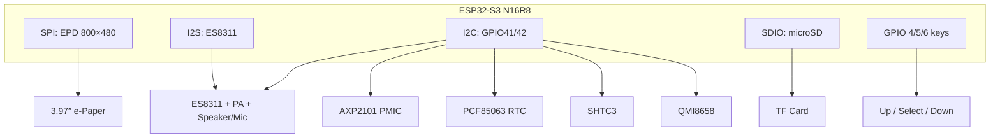

# Waveshare ESP32-S3 ePaper 3.97 — One-Stop Reference

Community firmware port: **CrossPoint Reader** (`1.3.0-WS397-RC`) — build the **full firmware** from this repo with `pio run -e esp32_s3_epaper_397` (see [README.md](README.md)).  
Hardware vendor: [Waveshare ESP32-S3-ePaper-3.97](https://www.waveshare.com/esp32-s3-epaper-3.97.htm) · [Wiki](https://www.waveshare.com/wiki/ESP32-S3-ePaper-3.97)

---

## 1. Board at a glance

| Item | Detail |
|------|--------|
| MCU | ESP32-S3-WROOM-1 **N16R8** (16 MB flash, 8 MB OPI PSRAM, up to 240 MHz) |
| Display | 3.97″ e-paper, **800×480**, controller family **SSD1677** (Waveshare `EPD_3in97`) |
| Storage | microSD (SDIO), FAT32 |
| Power | **AXP2101** PMIC, Li-ion charge, **PWR** key (PMIC PEK), Type-C USB |
| RTC | **PCF85063** (I²C) |
| Environment | **SHTC3** temp/humidity (I²C) |
| Motion | **QMI8658** 6-axis IMU (I²C) — page-turn gestures in CrossPoint |
| Audio | **ES8311** codec + **NS4150B** PA, onboard mic, MX1.25 speaker header |
| Buttons | 3× side keys (Up / Select / Down) + **BOOT** (GPIO0) + **PWR** (PMIC) |
| LEDs | GPIO43, GPIO44 |

**Do not** flash with `esp32-s3-devkitc-1` (8 MB, no PSRAM). Use board profile **N16R8** / env `esp32_s3_epaper_397`.

---

## 2. CrossPoint firmware — features on this board

Everything in the main [CrossPoint Reader](https://github.com/crosspoint-reader/crosspoint-reader) feature set (EPUB reader, Wi-Fi upload, OTA, KOReader sync, themes, etc.), plus **397-specific**:

| Feature | Notes |
|---------|--------|
| EPUB reading | 800×480 panel; orientation modes in Settings |
| Home menu extras | **Pictures**, **Music Player**, **Voice Recorder**, **Calendar**, **Clock** (alarms, stopwatch, countdown) |
| Status bar | Battery %, charge/VBUS, **temperature & humidity** (SHTC3) |
| Clock | **PCF85063** RTC; Settings → System: auto NTP sync, manual date/time/timezone, DST |
| Auto time sync | WiFi: NTP + timezone from IP (`ip-api.com`) when **Auto time sync** is on |
| Music | WAV/MP3 from `/music`; volume while playing; **flip 180°** for random track |
| Voice recorder | WAV to `/recordings`; uses ES8311 @ 24 kHz |
| Pictures | Browse `/pictures` on SD |
| IMU | Tilt / shake gestures (QMI8658), configurable in Settings |
| Deep sleep | Side keys wake; skips boot splash when resuming from sleep |
| SD folders | Auto-created on boot: `/pictures`, `/music`, `/recordings` |
| Sleep screen | Bottom-left **SLEEPING** or **POWERED OFF** on wallpaper; `sleep_bg` / `shutdown_bg` on SD; auto-rotates to fill screen |
| Countdown | Default 30 s; 1 s–3 days; alarm-style alert on finish |
| UI | Bottom button hints (Back/Up/Down) **hidden** — more menu/reader space |

### Build & flash

```bash
cd esp32s3-epaper-3.97-crosspoint-port   # this repo
pio run -e esp32_s3_epaper_397
pio run -e esp32_s3_epaper_397 -t upload
pio device monitor -b 115200
```

Tips: [docs/TIPS-397.md](docs/TIPS-397.md)

Hold **BOOT** (GPIO0) while connecting USB if the port does not appear.

---

## 3. Controls (CrossPoint on 3.97)

### Physical buttons

| Control | GPIO | Role in CrossPoint |
|---------|------|-------------------|
| **Up** | 4 | Previous / list up / page back (context) |
| **Select** (center) | 5 | Confirm / OK |
| **Down** | 6 | Next / list down / page forward (context) |
| **BOOT** | 0 | Short press → **Back**; hold **≥ 3 s** → **deep sleep** |
| **PWR** | AXP2101 PEK | Power on/off with battery (hardware); not used as a normal UI key |

Side keys are **active LOW** with internal pull-ups. Wake from deep sleep: **GPIO 4, 5, or 6** only (not BOOT).

### Center key (Select) — special timing

Designed for a single “OK” key without a dedicated Back key:

| Action | How |
|--------|-----|
| **OK / Confirm** | Tap center and release (< 1 s) → OK immediately |
| **Back** | Short **BOOT** press |
| **Go home (reader)** | Hold center **1–2.5 s**, then release |
| **Full panel refresh** | Hold center **≥ 2.5 s** (any screen) |

After IMU shake or some gestures, center OK is briefly suppressed to avoid stray confirms.

### Music Player

| State | Up / Down | Center |
|-------|-----------|--------|
| **Playing** | Volume **−** / **+** | Pause (`||`) |
| **Paused** (same track) | Move in list | Resume |
| **Idle** (no playback) | Move in list | Play selected track |

Volume is **system-wide** (saved); also used for voice playback.

### Voice Recorder

| Key | Action |
|-----|--------|
| Up / Down | Always move in list |
| Center | Top row: **start/stop record**; file row: **play / pause / resume** |
| BOOT short | Back (home) |

### Reader & global

| Action | Typical mapping |
|--------|-----------------|
| Page turn | Up / Down (or IMU tilt if enabled) |
| Back | BOOT short |
| Deep sleep | BOOT hold 3 s, or Settings sleep timeout |
| Recovery flash | Hold **Up + PWR** at cold boot (if supported by your build) |

### Schematic / pinout source files (local)

In this repo:

- [docs/hardware/waveshare-epaper-397/pinout.txt](docs/hardware/waveshare-epaper-397/pinout.txt) — GPIO summary  
- [docs/hardware/waveshare-epaper-397/tech-specs.txt](docs/hardware/waveshare-epaper-397/tech-specs.txt) — panel notes  
- Official schematic & vendor examples: [Waveshare wiki](https://www.waveshare.com/wiki/ESP32-S3-ePaper-3.97) → **Resources** (not bundled here — keeps the repo small)  

---

## 4. Wiring & bus diagram

All I²C peripherals share **GPIO41 (SDA)** and **GPIO42 (SCL)** @ **300 kHz** (CrossPoint 397; reduces contention with SHTC3/IMU).  
Display uses a **separate SPI** bus. SD card uses **SDIO**.



### Pin table (firmware: `lib/hal/HalGPIO.h`)

#### e-Paper (SPI)

| Signal | GPIO |
|--------|------|
| SCK | 11 |
| MOSI (DIN) | 12 |
| CS | 10 |
| DC | 9 |
| RST | 46 |
| BUSY | 3 |

#### microSD (SDIO)

| Signal | GPIO |
|--------|------|
| CLK | 16 |
| CMD | 17 |
| D0 | 15 |
| D1 | 7 |
| D2 | 8 |
| D3 (CS) | 18 |

#### Audio (ES8311 + I2S)

| Signal | GPIO | Notes |
|--------|------|--------|
| MCLK | 13 | |
| BCLK (SCLK) | 14 | |
| LRCK (WS) | **47** | Vendor `connections.txt` sometimes labels 21 — **firmware uses 47** |
| DIN (SD) | **21** | ESP → codec |
| DOUT | 48 | Codec → ESP |
| PA enable | **39** | `AUDIO_CTRL_PIN` — also labeled AXIS_INT1 on schematic |
| Codec I²C | 41 / 42 | Address **0x18** |

#### Shared I²C (41 / 42)

| Device | 7-bit address | Function |
|--------|---------------|----------|
| AXP2101 | 0x34 | Battery, charge, PEK, IRQ |
| PCF85063 | 0x51 | RTC |
| SHTC3 | 0x70 | Temperature & humidity |
| QMI8658 | 0x6B (alt 0x6A) | Accelerometer + gyro |
| ES8311 | 0x18 | Audio codec |

#### Other GPIO

| GPIO | Function |
|------|----------|
| 0 | BOOT (USB download / UI Back / sleep) |
| 1 | PWR_OUT (PMIC key sense) |
| 2 | ESP_CHG |
| 38 | AXP_PWR_IRQ |
| 39 | Audio PA (see above) |
| 40 | IMU INT2 |
| 43 / 44 | LEDs |
| 45 | RTC_INT |
| 19 / 20 | USB D− / D+ |

**Bus discipline:** Use one I²C mutex for all slaves (`board397.acquireSharedI2c()` / `releaseSharedI2c()`). Never talk to SHTC3/RTC/PMIC/IMU/codec from unrelated tasks without locking.

---

## 5. User manual (quick)

### First boot

1. Insert a **FAT32** microSD card.  
2. Flash `esp32_s3_epaper_397` firmware.  
3. On first boot, folders `/pictures`, `/music`, `/recordings` are created if missing.  
4. Connect WiFi (Settings) for book upload, OTA, and auto time sync.

### Books & files

- Put **EPUB** files anywhere on the SD card; open via **Browse files**.  
- Wi-Fi file transfer: Settings → enable Wi-Fi, note the IP, open the web portal from a browser on the same network (see [README.md](README.md)).

### Clock

- **Settings → System → Auto time sync**: when ON, manual date/time/timezone entries are disabled; RTC is set from NTP when WiFi connects; timezone offset can be fetched from your public IP.  
- When auto sync is OFF, use **Set date & time** and set timezone offset / DST manually.

### Environment readout

- Top bar shows **°C** and **%RH** when SHTC3 probes successfully.  
- Serial log: `SHTC3 ID 0x0887` (or `0x0807`) is normal — both IDs are valid per Sensirion datasheet.  
- ~4 °C software offset is applied for PCB self-heating near the panel.

### Power & sleep

- **Deep sleep:** BOOT hold 3 s, or auto sleep timer in Settings → uses `sleep_bg` on SD; bottom label **SLEEPING**. Wallpaper images auto-rotate portrait/landscape to maximize screen use.  
- **Power off:** Settings → System → **Power off** → `shutdown_bg`; bottom label **POWERED OFF** (same auto-rotate behavior).  
- **Wake:** press Up, Select, or Down. Resume goes to **Home** (or reader if you slept inside a book).  
- **USB serial reset** (`rst:0x15 USB_UART_CHIP_RESET`) is not GPIO wake — unplug USB to test real button wake.  
- **Battery:** use 3.7 V Li-ion on MX1.25 connector; optional RTC backup cell on separate header.

### Audio

- Copy **WAV/MP3** into `/music`.  
- Recordings saved as WAV under `/recordings` (24 kHz mono, 16-bit).  
- Adjust volume while music is **playing**; level is remembered for all playback.

---

## 6. Important init code

Copy-paste oriented snippets matching **CrossPoint** / Waveshare behavior. Adjust only if your hardware revision differs.

### 6.1 Shared I²C bus

```cpp
#include <Wire.h>

constexpr int I2C_SDA = 41;
constexpr int I2C_SCL = 42;
constexpr uint32_t I2C_FREQ = 300000;  // 397 CrossPoint

void i2cBegin() {
  Wire.begin(I2C_SDA, I2C_SCL, I2C_FREQ);
  Wire.setTimeOut(8);  // ms
}
```

### 6.2 AXP2101 PMIC (probe + minimal init)

```cpp
constexpr uint8_t AXP_ADDR = 0x34;
constexpr uint8_t AXP_CHIP_ID_REG = 0x03;
constexpr uint8_t AXP_CHIP_ID_EXPECTED = 0x4A;

bool axpProbe() {
  Wire.beginTransmission(AXP_ADDR);
  Wire.write(AXP_CHIP_ID_REG);
  if (Wire.endTransmission(false) != 0) return false;
  if (Wire.requestFrom(AXP_ADDR, (uint8_t)1) < 1) return false;
  return Wire.read() == AXP_CHIP_ID_EXPECTED;
}

void axpInitBasic() {
  auto wr = [](uint8_t reg, uint8_t val) {
    Wire.beginTransmission(AXP_ADDR);
    Wire.write(reg);
    Wire.write(val);
    Wire.endTransmission();
  };
  auto rdModWr = [](uint8_t reg, uint8_t mask, uint8_t set) {
    Wire.beginTransmission(AXP_ADDR);
    Wire.write(reg);
    Wire.endTransmission(false);
    Wire.requestFrom(AXP_ADDR, (uint8_t)1);
    uint8_t v = Wire.read();
    v = (v & ~mask) | (set & mask);
    Wire.beginTransmission(AXP_ADDR);
    Wire.write(reg);
    Wire.write(v);
    Wire.endTransmission();
  };
  rdModWr(0x68, 0x01, 0x01);  // fuel gauge
  rdModWr(0x30, 0x01, 0x01);  // battery voltage ADC
  wr(0x27, 0x07);             // PEK short/long press enable
  // Clear IRQ latches (write-1-to-clear): regs 0x48, 0x49, 0x4A
}
```

Battery SOC: register **0xA4** (%). Charging / VBUS: status registers **0x00** / **0x01**.

### 6.3 PCF85063 RTC

```cpp
constexpr uint8_t RTC_ADDR = 0x51;
constexpr uint8_t RTC_SECONDS = 0x04;

bool rtcProbe() {
  Wire.beginTransmission(RTC_ADDR);
  Wire.write(RTC_SECONDS);
  if (Wire.endTransmission(false) != 0) return false;
  if (Wire.requestFrom(RTC_ADDR, (uint8_t)1) < 1) return false;
  uint8_t sec = Wire.read() & 0x7F;
  return ((sec >> 4) & 0x07) <= 5 && (sec & 0x0F) <= 9;
}

// Read 7 bytes from RTC_SECONDS: sec, min, hour, day, weekday, month, year (BCD)
// Clear STOP bit in control register 0x00 bit 5 after setting time.
```

### 6.4 SHTC3 (Sensirion) — full cycle

Valid product IDs include **0x0807** and **0x0887** (check: bit 11 set, bits 5:0 == `0x07`).

```cpp
constexpr uint8_t SHTC3_ADDR = 0x70;

enum Shtc3Cmd : uint16_t {
  SLEEP      = 0xB098,
  WAKEUP     = 0x3517,
  SOFT_RESET = 0x805D,
  READ_ID    = 0xEFC8,
  MEASURE    = 0x7866,  // T first, RH, normal mode, no clock stretch
};

bool shtc3WriteCmd(uint16_t cmd) {
  Wire.beginTransmission(SHTC3_ADDR);
  Wire.write((uint8_t)(cmd >> 8));
  Wire.write((uint8_t)(cmd & 0xFF));
  return Wire.endTransmission() == 0;
}

bool shtc3Measure(float& tempC, float& rh) {
  shtc3WriteCmd(SOFT_RESET);
  delay(1);
  shtc3WriteCmd(WAKEUP);
  delay(2);
  shtc3WriteCmd(MEASURE);
  delay(13);  // t_MEAS max
  if (Wire.requestFrom(SHTC3_ADDR, (uint8_t)6) < 6) { shtc3WriteCmd(SLEEP); return false; }
  uint8_t b[6];
  for (int i = 0; i < 6; i++) b[i] = Wire.read();
  shtc3WriteCmd(SLEEP);
  // Verify CRC8 on [b0,b1] and [b3,b4] (poly 0x31, init 0xFF)
  uint16_t rawT = (b[0] << 8) | b[1];
  uint16_t rawH = (b[3] << 8) | b[4];
  tempC = 175.0f * (rawT / 65536.0f) - 45.0f - 4.0f;  // 4°C PCB offset (Waveshare)
  rh    = 100.0f * (rawH / 65536.0f);
  return true;
}
```

### 6.5 QMI8658 IMU (minimal probe)

```cpp
constexpr uint8_t QMI_ADDR = 0x6B;       // try 0x6A if no response
constexpr uint8_t QMI_WHO_AM_I = 0x00;
constexpr uint8_t QMI_EXPECTED_ID = 0x05;

bool imuProbe() {
  Wire.beginTransmission(QMI_ADDR);
  Wire.write(QMI_WHO_AM_I);
  Wire.endTransmission(false);
  Wire.requestFrom(QMI_ADDR, (uint8_t)1);
  return Wire.available() && Wire.read() == QMI_EXPECTED_ID;
}
// Full driver: configure CTRL registers, read accel @ 0x35+ etc. (see HalTiltSensor.cpp)
```

### 6.6 ES8311 + I2S (CrossPoint / Xiaozhi pins)

GPIO **39** (`AUDIO_CTRL_PIN`) enables the **NS4150B** speaker amplifier (active HIGH).

**Anti-pop sequence (implemented in `HalAudio397.cpp`):**

| Phase | Steps |
|-------|--------|
| **Boot** | `HalAudio397::ensureAmplifierOff()` from `HalGPIO::begin()` — PA stays LOW. |
| **Power on** | Init ES8311 **muted** → start I2S → flush ~384 samples of silence → unmute → **then** enable PA. |
| **Power off** | Mute DAC + hardware fade → stop I2S → PA LOW → delete codec handle. |
| **Navigation** | Music/Voice activities avoid a **second** `shutdown()` after playback (prevents click on exit). |
| **Deep sleep** | `shutdown()` if codec active, else `ensureAmplifierOff()` only. |

```cpp
// Pins (see HalGPIO.h)
#define I2S_MCLK  13
#define I2S_BCLK  14
#define I2S_LRCK  47
#define I2S_DIN   21
#define I2S_DOUT  48
#define PA_GPIO   39   // NS4150B enable — enable LAST on start, disable FIRST on stop

#define ES8311_ADDR 0x18
#define SAMPLE_RATE 24000
```

Do **not** enable the PA before the codec is running and muted; the Waveshare `01_Audio_Test` example turns PA on early and can click on other boards — CrossPoint uses the sequence above instead.

Reference: `lib/hal/HalAudio397.cpp`, `lib/audio397/es8311.cpp` (`es8311_voice_mute`, `es8311_voice_fade`).

### 6.7 e-Paper (Waveshare driver sketch)

```cpp
// Resolution
#define EPD_WIDTH  800
#define EPD_HEIGHT 480

// SPI pins: SCK=11, MOSI=12, CS=10, DC=9, RST=46, BUSY=3
// Waveshare: EPD_3IN97_Init(); ... paint buffer ... EPD_3IN97_Display();
```

CrossPoint wraps the panel via `HalDisplay` / `EInkDisplay` with the same pin defines.

### 6.8 Deep sleep wake (side keys)

```cpp
#include <driver/rtc_io.h>
#include <esp_sleep.h>

void sleepWakeOnSideKeys() {
  const gpio_num_t pins[] = {GPIO_NUM_4, GPIO_NUM_5, GPIO_NUM_6};
  for (gpio_num_t p : pins) {
    rtc_gpio_init(p);
    rtc_gpio_set_direction(p, RTC_GPIO_MODE_INPUT_ONLY);
    rtc_gpio_pullup_en(p);
    rtc_gpio_pulldown_dis(p);
  }
  uint64_t mask = (1ULL << 4) | (1ULL << 5) | (1ULL << 6);
  esp_sleep_enable_ext1_wakeup(mask, ESP_EXT1_WAKEUP_ANY_LOW);
  esp_deep_sleep_start();
}
```

Clear **AXP2101** IRQ status registers before sleep to avoid spurious wake on GPIO38.

---

## 7. SD card layout

| Path | Purpose |
|------|---------|
| `/` | EPUBs, general files |
| `/music` | WAV / MP3 for Music Player |
| `/recordings` | Voice recorder WAV files |
| `/pictures` | Images for gallery activity |

---

## 8. Troubleshooting

| Symptom | Likely cause / fix |
|---------|-------------------|
| No temp/humidity on bar | SHTC3 probe failed — check I²C, serial for `SHTC3 ID`; valid IDs `0x0807` / `0x0887` |
| Wrong time | Enable WiFi + auto sync, or set RTC manually; check timezone offset |
| Boot logo after sleep | Normal on cold boot; GPIO wake should skip boot → Home |
| `USB_UART_CHIP_RESET` in log | USB reconnect, not button wake — test on battery |
| No audio | PA pin 39 HIGH? ES8311 init? WAV sample rate supported? |
| Short speaker **pop** on app change / sleep | Fixed in firmware: mute-before-PA-off, PA-on-last, no double `shutdown()` on Music exit. Reflash `HalAudio397` build. |
| I²C hangs | Multiple drivers without mutex; reduce clock; check bus shorts |
| Flash fails | Wrong board profile — must be **N16R8** with PSRAM |
| `Total image size` build note | Informational only — see [docs/TIPS-397.md](docs/TIPS-397.md); app uses ~69% of 8 MB |
| Vietnamese UI `No glyph` | Font lacks diacritics — use English UI or extend fonts |

---

## 9. Source code map (CrossPoint)

| Topic | Files |
|-------|--------|
| Pins & addresses | `lib/hal/HalGPIO.h` |
| PMIC / RTC / SHTC3 | `lib/hal/HalBoard397.cpp`, `.h` |
| Audio | `lib/hal/HalAudio397.cpp`, `lib/audio397/` |
| IMU | `lib/hal/HalTiltSensor.cpp` |
| Buttons | `open-x4-sdk/libs/hardware/InputManager/src/InputManager.cpp` |
| Sleep / wake | `lib/hal/HalGPIO.cpp`, `src/main.cpp` |
| NTP / timezone | `lib/hal/HalTimeSync397.cpp` |
| Build env | `platformio.ini` → `[env:esp32_s3_epaper_397]` |

Vendor examples (Arduino/ESP-IDF): download from the [Waveshare wiki](https://www.waveshare.com/wiki/ESP32-S3-ePaper-3.97) — not stored in this lean port tree.

---

## 10. Revision notes

- **I2S LRCK** is **GPIO47** in shipping CrossPoint firmware (matches Xiaozhi `config.h`). Older text files that say GPIO21 for LRCK refer to a different label (DIN).  
- **GPIO39** is used for the **speaker PA** in firmware; the same pin may be named IMU INT1 on the schematic — do not drive both functions at once.  
- **SHTC3** must be woken before each measurement and put back to sleep afterward (low power, reliable reads).

---

*Document generated for the Waveshare ESP32-S3 ePaper 3.97 + CrossPoint Reader port. Update when pin maps or vendor PCB revisions change.*
